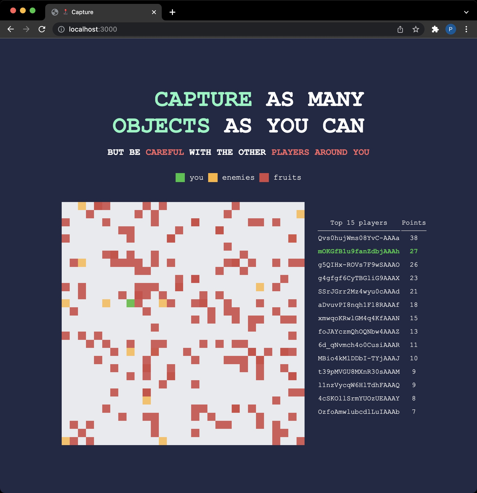

# Multiplayer capture game

This repository aims to create a multiplayer game where all the players need to catch some fruit in order to gain points and probably win the game 🏆

This game is made using HTML, CSS and JavaScript with a backend made with Node and web-sockets.



# Setup

## Clone repository

Create and go to the directory where you want to place the repository

```bash
  cd my-directory
```

Clone the project

```bash
  git clone https://github.com/pncsoares/capture-game.git
```

Go to the project directory

```bash
  cd capture-game
```

## Install dependencies

```bash
    npm install
```

## Start the server

```bash
    nodemon
```

## Contribution guidelines

* Add some game features
* If you see some bug, feel free to report it or even to solve it
* Please create always a new branch from development and then create a Pull Request to development branch so we can code review it

# License

MIT